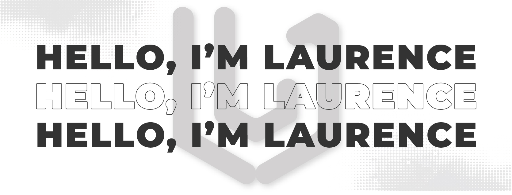
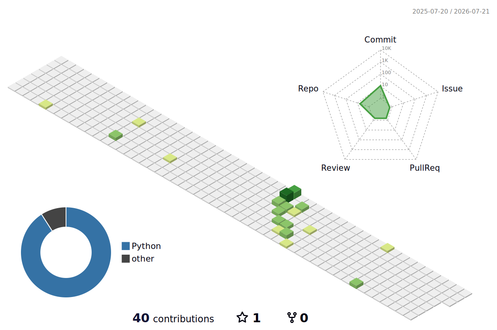

### About Me
I am currently a student exploring the intersection of clean software development and user-centric design. I love building cross-platform applications and crafting digital experiences.

### Tech Stack & Tools

#### Development
<!-- Flutter -->

<!-- Dart -->
 &nbsp;
<!-- Python -->
  
<!-- Java -->

#### Design
<!-- Figma -->
  <!-- Illustrator -->
  <!-- Photoshop -->

## Contributions Calendar
